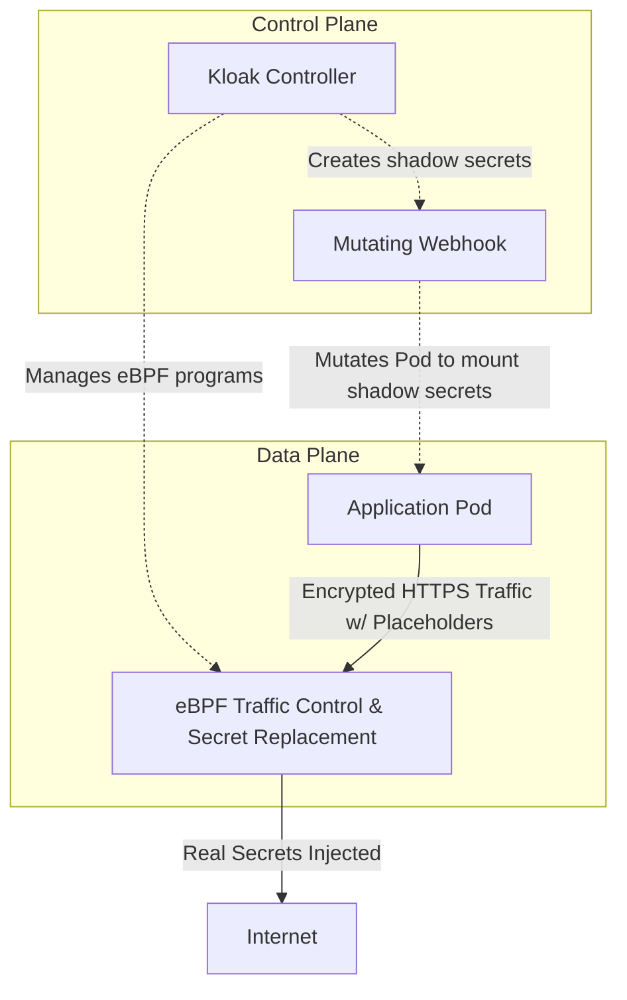

<div align="center">
  <a href="https://getkloak.io/"></a>
</div>

<h1 align="center"><a href="https://getkloak.io/">Kloak</a></h1>

<p align="center">
  <b>Secure Your Secrets, Agentless</b><br>
  Kubernetes eBPF Secret Interceptor for HTTPS. Secure secret management without application changes or sidecars.
</p>

<div align="center">

[](https://github.com/spinningfactory/kloak/actions/workflows/ci.yml)

[](https://go.dev/)
[](https://kubernetes.io/)
[](LICENSE)

</div>

---

Kloak transparently intercepts HTTPS traffic in Kubernetes using **pure eBPF**, replacing hashed placeholders with real secrets at the network edge. Your applications never see the actual credentials, and **no sidecars are required.**

## ✨ Features

- 🔐 **Secure by Design** - Secrets are replaced at the network edge. Your application code never sees real credentials.
- ⚡ **Zero Latency Impact** - eBPF-powered traffic redirection happens in kernel space, adding negligible overhead.
- ☸️ **Kubernetes Native** - Works seamlessly with standard Kubernetes Secrets. Just add a label.
- 🎯 **Host Restrictions** - Fine-grained access control ensuring secrets are only sent to authorized hosts.
- 🛠 **Zero Code Changes** - No SDK required. Works with any language or framework. Just use the hash placeholder.
- 🚀 **Pure eBPF Integration** - No bulky sidecars or complex CNI plugins. Operates purely at the kernel level for maximum efficiency.

## 🏗 Architecture

Kloak separates concerns into a robust control plane and an ultra-fast data plane.



### Component Breakdown

| Component | Description |
|-----------|-------------|
| **Controller** | Watches Kubernetes secrets labeled with `getkloak.io/enabled=true` and manages eBPF programs in the kernel. |
| **Webhook** | Mutating admission webhook that intercepts Pod creation. Instead of injecting sidecars, it rewrites Secret volume mounts to point to Kloak's generated shadow secrets containing hashes. |
| **Data Plane (eBPF)** | Pure kernel-space interception and replacement of hashed placeholders with real secret values during active HTTPS connections. |

## 🚀 How It Works

### 1. Register Your Secrets
Label your Kubernetes secrets with `getkloak.io/enabled=true`. Kloak generates a unique hash (UUID) for each secret value.

```yaml
labels:
  getkloak.io/enabled: "true"
  getkloak.io/hosts: "api.example.com"
```

### 2. Use Hash Placeholders
Reference the generated hash in your application config or code instead of the actual secret. Your app never sees the real value.

```yaml
headers:
  Authorization: "kloak:a1b2c3d4-e5f6-7890"
```

### 3. Automatic Transform
When your app makes an outbound HTTPS request, Kloak natively intercepts it in kernel-space and replaces the hash with the real secret before forwarding the packet.

```http
# What leaves your pod exactly as required:
Authorization: Bearer sk-live-xyz123...
```

## 🛠 Quick Start

### Prerequisites
- A Kubernetes cluster (1.28+) with Linux kernel 5.17+
- [Helm](https://helm.sh/docs/intro/install/) 3.12+
- `kubectl` configured with cluster access

### Install with Helm

```bash
# Add the Kloak Helm repository
helm repo add kloak https://getkloak.github.io/kloak
helm repo update

# Install Kloak
helm install kloak kloak/kloak -n kloak-system --create-namespace

# Verify the installation
kubectl get pods -n kloak-system
```

### Try the Demo

The easiest way to see Kloak in action is to run the local demo:

```bash
# Run the full demo (creates Lima VM with K3s, deploys everything)
./examples/setup-demo.sh

# Access the cluster
export KUBECONFIG=/tmp/kloak-k3s.yaml

# View demo logs
kubectl logs -f demo-python -n kloak-demo -c demo-app

# Cleanup
./examples/destroy-demo.sh
```

### Manual Build & Development

```bash
# Build binary
make build

# Run tests
make test

# Build Docker image
make docker-build
```

**eBPF Development (macOS)**: Kloak uses Lima for eBPF development on macOS.

```bash
make lima-start    # Start Lima VM
make generate-ebpf # Generate eBPF code
make test-linux    # Run tests in Linux VM
make lima-shell    # Open shell in Lima VM
```

## 📄 License

Apache 2.0
