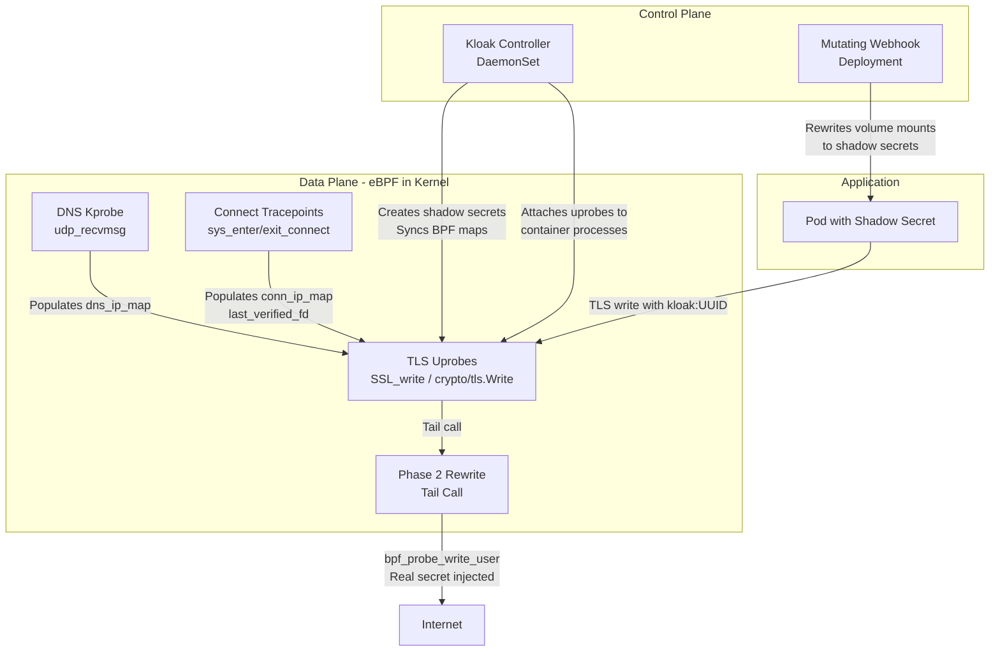
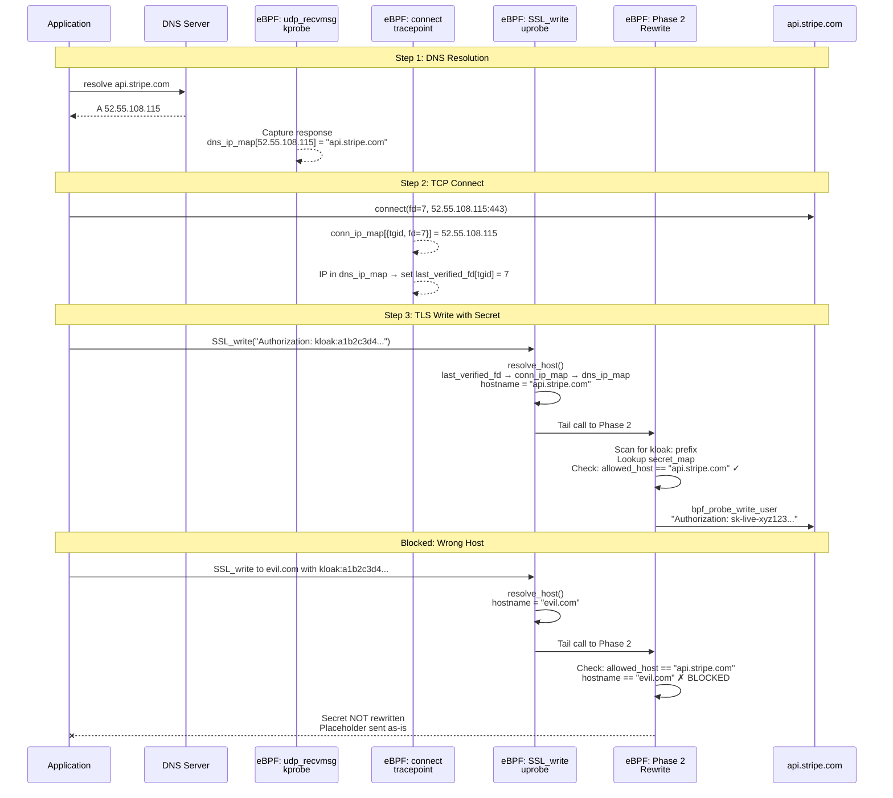

<div align="center">
  <a href="https://getkloak.io/"></a>
</div>

<h1 align="center"><a href="https://getkloak.io/">Kloak</a></h1>

<p align="center">
  <b>Secure Your Secrets, Agentless</b><br>
  Kubernetes eBPF Secret Interceptor for HTTPS. Secure secret management without application changes or sidecars.
</p>

<div align="center">

[](https://github.com/spinningfactory/kloak/actions/workflows/ci.yml)

[](https://go.dev/)
[](https://kubernetes.io/)
[](LICENSE)

</div>

---

Kloak transparently intercepts HTTPS traffic in Kubernetes using **pure eBPF**, replacing hashed placeholders with real secrets at the network edge. Your applications never see the actual credentials, and **no sidecars are required.**

## ✨ Features

- 🔐 **Secure by Design** - Secrets are replaced at the network edge. Your application code never sees real credentials.
- ⚡ **Zero Latency Impact** - eBPF-powered traffic redirection happens in kernel space, adding negligible overhead.
- ☸️ **Kubernetes Native** - Works seamlessly with standard Kubernetes Secrets. Just add a label.
- 🎯 **DNS-Verified Host Filtering** - Secrets are only sent to hosts verified through the DNS resolution chain. No DNS match, no secret.
- 🛠 **Zero Code Changes** - No SDK required. Works with any language or framework (Go, Python, Node.js, and any OpenSSL-based runtime).
- 🚀 **Pure eBPF Integration** - No bulky sidecars or complex CNI plugins. Operates purely at the kernel level for maximum efficiency.

## 🏗 Architecture

Kloak separates concerns into a robust control plane and an ultra-fast data plane.



### Component Breakdown

| Component | Description |
|-----------|-------------|
| **Controller** (DaemonSet) | Watches Secrets labeled `getkloak.io/enabled=true`, creates shadow secrets with `kloak:<UUID>` placeholders, syncs real values to eBPF maps, attaches TLS uprobes to container processes. |
| **Webhook** (Deployment) | Mutating admission webhook that intercepts Pod creation. Rewrites Secret volume mounts to point to shadow secrets. Checks enablement via pod annotations, namespace labels, or owner workload labels. |
| **TLS Uprobes** | Attach to `SSL_write`/`SSL_write_ex` (OpenSSL/BoringSSL) or `crypto/tls.(*Conn).Write` (Go). Intercept TLS writes, scan for `kloak:` prefixes, and rewrite with real secrets via `bpf_probe_write_user`. |
| **DNS Kprobe** | Hooks `udp_recvmsg` to capture DNS responses globally. Parses A/AAAA records for watched hostnames and populates `dns_ip_map` (IP → hostname). |
| **Connect Tracepoints** | Hooks `sys_enter/exit_connect` to track TCP connections (fd → destination IP). When a connection's IP matches a DNS-verified hostname, sets `last_verified_fd`. |

## 🔒 DNS-Verified Trust Chain

Secrets with `getkloak.io/hosts` are only rewritten when the destination is verified through the DNS resolution chain. This prevents secret exfiltration to unauthorized servers.



### How Host Verification Works

1. **DNS Capture** — A kprobe on `udp_recvmsg` intercepts all DNS responses on the node. For hostnames in `watched_hosts` (derived from `getkloak.io/hosts` labels), the resolved IPs are stored in `dns_ip_map`.

2. **Connection Tracking** — Tracepoints on `sys_enter/exit_connect` record every TCP connection's fd → destination IP mapping in `conn_ip_map`. If the IP exists in `dns_ip_map`, the fd is cached in `last_verified_fd`.

3. **Host Resolution** — At `SSL_write` time, `resolve_host()` chains: `last_verified_fd` → `conn_ip_map` → `dns_ip_map` to determine the hostname of the current TLS connection.

4. **Secret Filtering** — Phase 2 compares the resolved hostname against the secret's `allowed_host`. Match → rewrite. Mismatch → placeholder sent as-is (secret stays safe).

5. **TTL Enforcement** — DNS entries include a TTL. Expired entries are skipped on lookup, forcing re-verification through fresh DNS responses.

## 🚀 How It Works

### 1. Register Your Secrets
Label your Kubernetes secrets with `getkloak.io/enabled=true`. Kloak generates a shadow secret with `kloak:<UUID>` placeholders matching the original value lengths.

```yaml
apiVersion: v1
kind: Secret
metadata:
  name: api-credentials
  labels:
    getkloak.io/enabled: "true"
    getkloak.io/hosts: "api.stripe.com"
data:
  api-key: c2stbGl2ZS14eXoxMjM=  # sk-live-xyz123
```

### 2. Use Hash Placeholders
Your application mounts the shadow secret (automatically rewritten by the webhook) and uses the `kloak:<UUID>` placeholder. It never sees the real value.

```yaml
headers:
  Authorization: "Bearer kloak:a1b2c3d4-e5f6-7890"
```

### 3. Automatic In-Kernel Rewrite
When your app makes an outbound HTTPS request, the eBPF uprobe intercepts the TLS write, verifies the destination host via the DNS chain, and replaces the placeholder with the real secret before encryption.

```
# What your app writes:
Authorization: Bearer kloak:a1b2c3d4-e5f6-7890

# What actually leaves the pod (after eBPF rewrite):
Authorization: Bearer sk-live-xyz123
```

### Supported Runtimes

| Runtime | TLS Library | Hook Point |
|---------|------------|------------|
| Python | OpenSSL (libssl.so) | `SSL_write` uprobe |
| Node.js | BoringSSL (statically linked) | `SSL_write` uprobe |
| Go | crypto/tls | `crypto/tls.(*Conn).Write` uprobe |
| Rust, Ruby, PHP, curl | OpenSSL/BoringSSL | `SSL_write` / `SSL_write_ex` uprobe |

## 🛠 Quick Start

### Prerequisites
- A Kubernetes cluster (1.28+) with Linux kernel 5.17+
- [Helm](https://helm.sh/docs/intro/install/) 3.12+
- `kubectl` configured with cluster access

### Install with Helm

```bash
# Add the Kloak Helm repository
helm repo add kloak https://getkloak.github.io/kloak
helm repo update

# Install Kloak
helm install kloak kloak/kloak -n kloak-system --create-namespace

# Verify the installation
kubectl get pods -n kloak-system
```

### Try the Demo

The easiest way to see Kloak in action is to run the local demo:

```bash
# Run the full demo (creates Lima VM with K3s, deploys everything)
./examples/setup-demo.sh

# Access the cluster
export KUBECONFIG=/tmp/kloak-k3s.yaml

# View demo logs (should show real secrets in httpbin.org responses)
kubectl logs -f -l app=demo-python -n kloak-demo -c demo-app

# Cleanup
./examples/destroy-demo.sh
```

### Manual Build & Development

```bash
# Build binary
make build

# Run tests
make test

# Build Docker image
make docker-build
```

**eBPF Development (macOS)**: Kloak uses Lima for eBPF development on macOS.

```bash
make lima-start    # Start Lima VM
make generate-ebpf # Generate eBPF code
make test-linux    # Run tests in Linux VM
make lima-shell    # Open shell in Lima VM
```

## 📄 License

Apache 2.0
