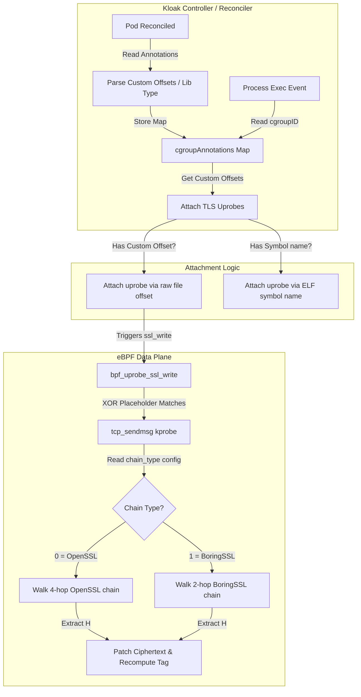

# Solution Design: Supporting Symbol-Stripped Statically-Linked BoringSSL & Bun (Issue #229)

This document outlines the architectural plan to resolve [Issue #229](https://github.com/spinningfactory/kloak/issues/229) to support the Claude Code CLI (`claude`) and any other applications running under the Bun JS runtime.

---

## 1. Root Cause Analysis

The failure of Kloak to intercept secrets sent by the Claude Code CLI (`claude`) stems from two distinct, concurrent blockers:

1. **Statically-Linked, Symbol-Stripped Binary (Attachment Blocker)**
   - The `claude` binary (compiled/packaged via Bun) contains statically linked BoringSSL.
   - The symbol table (`.symtab`) and dynamic symbol table (`.dynsym`) are fully stripped.
   - Kloak's controller calls `link.Executable.Uprobe("SSL_write", ...)` which resolves the function entry address via the ELF symbol tables. Because `SSL_write` does not exist in the symbol tables, the uprobe fails to attach.

2. **Missing BoringSSL Key Extraction Chain (Extraction Blocker)**
   - Even if Kloak could attach to the `SSL_write` offset in the binary, BoringSSL uses a different struct layout than OpenSSL to store the AES-GCM GHASH $H$ key.
   - OpenSSL uses a 4-hop chain (`SSL` $\to$ `rlayer.wrl` $\to$ `enc_ctx` $\to$ `algctx` $\to$ $H$).
   - BoringSSL uses a 2-hop chain (`SSL` $\to$ `s3` $\to$ `aead_write_ctx` $\to$ $H$).
   - Without the BoringSSL extraction logic in `tls_uprobe.c`, Kloak cannot retrieve the key to recompute the authentication tag, resulting in a "bad record MAC" error.

---

## 2. Proposed Architecture & Solutions

To close these gaps, we propose a two-part solution matching both requirements:



### Prerequisite A: BoringSSL Support (Porting PR #88)
First, we must incorporate the core BoringSSL H-extraction logic proposed in draft [PR #88](https://github.com/spinningfactory/kloak/pull/88):
- Extend `TLSOffsets` with `ChainType` (OpenSSL vs. BoringSSL) and BoringSSL specific fields (`SSLToS3`, `S3ToAEAD`, `AEADToH`).
- Implement the 2-dereference BoringSSL key-walk inside `tls_uprobe.c`'s `tcp_sendmsg` path.
- Add standard `boringssl` offset entries in `openssl_offsets.go`.

### Prerequisite B: Symbol-Less Attachment Fallback
Second, we must allow attaching uprobes directly to a function's raw file offset when symbols are missing. We propose two complementary designs:

#### Design 1: Kubernetes-Native Pod Annotations (Escape Hatch)
Provide an escape hatch where users can specify the exact offsets of the `SSL_write` and `SSL_write_ex` functions in their stripped binaries using pod annotations. 
- `getkloak.io/ssl-write-offset`: Hex offset of `SSL_write` (e.g., `"0x1a2b3c"`).
- `getkloak.io/ssl-write-ex-offset`: Hex offset of `SSL_write_ex`.
- `getkloak.io/tls-library-type`: `"boringssl"` (tells Kloak to use BoringSSL offsets for key extraction).
- `getkloak.io/ssl-to-s3-offset`, `getkloak.io/s3-to-aead-offset`, `getkloak.io/aead-to-h-offset`: Allows overriding struct offsets for custom BoringSSL versions.

#### Design 2: Automatic Signature Scanning / Section Analysis (Zero-Config Fallback)
If no annotations are provided, Kloak can fall back to searching the `.text` segment of `/proc/<pid>/exe` for a known compilation signature of `SSL_write` / `SSL_write_ex` in BoringSSL, or looking up the binary's SHA256 checksum in a pre-populated table of popular tool releases (like Claude CLI).

---

## 3. Implementation Details & Code Diffs

Here is the exact implementation structure required to realize the solution.

### Part 1: Registering and Mapping Pod Annotations

We extend `TLSUprobeManager` to track cgroup-level annotations. When a pod is reconciled, the controller stores its custom offsets.

#### File: `pkg/ebpf/uprobe.go`

```go
// Add cgroupAnnotations to the manager struct:
type TLSUprobeManager struct {
	// ...
	cgroupAnnotations sync.Map // uint64 (cgroup ID) -> map[string]string
	// ...
}
```

Add a method to store annotations when tracking a cgroup:

```go
func (m *TLSUprobeManager) TrackCgroupWithAnnotations(cgroupID uint64, path string, annotations map[string]string) error {
	m.cgroupAnnotations.Store(cgroupID, annotations)
	return m.TrackCgroup(cgroupID, path)
}
```

Update `pkg/controller/reconciler.go` to call this new method:

```go
// pkg/controller/reconciler.go
if r.UprobeManager != nil {
	if err := r.UprobeManager.TrackCgroupWithAnnotations(cgroupID, cgroupPath, pod.Annotations); err != nil {
```

### Part 2: Custom Offset Uprobe Attachment

In `AttachTLS`, if the pod contains custom offset annotations, we bypass symbol resolution and hook the raw offsets:

#### File: `pkg/ebpf/uprobe.go`

```go
func (m *TLSUprobeManager) AttachTLS(pid int, cgroupID uint64) error {
	exePath := fmt.Sprintf("/proc/%d/exe", pid)

	// Register the process for DNS/connect tracking.
	if err := m.TrackTGID(uint32(pid)); err != nil {
		m.log.Errorw("failed to track TGID for DNS/connect", "error", err, "pid", pid)
	}

	// Open the executable
	ex, err := link.OpenExecutable(exePath)
	if err != nil {
		return fmt.Errorf("opening executable %s: %w", exePath, err)
	}

	// 1. Try Go crypto/tls
	goWriteSym := "crypto/tls.(*Conn).Write"
	if up, err := ex.Uprobe(goWriteSym, m.objs.BpfUprobeGoTlsWrite, &link.UprobeOptions{PID: pid}); err == nil {
		// Go uprobe attached successfully...
		return nil
	}

	attached := false

	// Retrieve custom offsets from pod annotations
	var sslWriteOffset uint64
	var sslWriteExOffset uint64
	var tlsLibType string
	customStructOffsets := false
	var customOffsets TLSOffsets

	if val, ok := m.cgroupAnnotations.Load(cgroupID); ok {
		if ann, ok := val.(map[string]string); ok {
			if offStr := ann["getkloak.io/ssl-write-offset"]; offStr != "" {
				if val, err := strconv.ParseUint(strings.TrimPrefix(offStr, "0x"), 16, 64); err == nil {
					sslWriteOffset = val
				}
			}
			if offStr := ann["getkloak.io/ssl-write-ex-offset"]; offStr != "" {
				if val, err := strconv.ParseUint(strings.TrimPrefix(offStr, "0x"), 16, 64); err == nil {
					sslWriteExOffset = val
				}
			}
			tlsLibType = ann["getkloak.io/tls-library-type"]

			// Optional custom struct offsets
			if ann["getkloak.io/ssl-to-s3-offset"] != "" {
				customStructOffsets = true
				customOffsets.ChainType = ChainBoringSSL
				customOffsets.SSLToS3 = parseUint32(ann["getkloak.io/ssl-to-s3-offset"])
				customOffsets.S3ToAEAD = parseUint32(ann["getkloak.io/s3-to-aead-offset"])
				customOffsets.AEADToH = parseUint32(ann["getkloak.io/aead-to-h-offset"])
				customOffsets.WBIOOffset = parseUint32(ann["getkloak.io/ssl-to-wbio-offset"])
				customOffsets.BIONumOffset = parseUint32(ann["getkloak.io/bio-to-num-offset"])
			}
		}
	}

	// 2. Attach using custom raw offsets if specified
	if sslWriteOffset > 0 {
		up, err := ex.Uprobe("", m.objs.BpfUprobeSslWrite, &link.UprobeOptions{PID: pid, Offset: sslWriteOffset})
		if err == nil {
			m.log.Infow("Attached uprobe via custom offset to main exe", "pid", pid, "offset", sslWriteOffset)
			m.linksMu.Lock()
			m.links = append(m.links, up)
			m.linksMu.Unlock()
			attached = true
		} else {
			m.log.Errorw("Failed to attach uprobe via custom offset", "error", err, "pid", pid, "offset", sslWriteOffset)
		}
	}
	if sslWriteExOffset > 0 {
		up, err := ex.Uprobe("", m.objs.BpfUprobeSslWrite, &link.UprobeOptions{PID: pid, Offset: sslWriteExOffset})
		if err == nil {
			m.log.Infow("Attached uprobe_ex via custom offset to main exe", "pid", pid, "offset", sslWriteExOffset)
			m.linksMu.Lock()
			m.links = append(m.links, up)
			m.linksMu.Unlock()
			attached = true
		}
	}

	// 3. Fallback to standard symbol-based attachment for un-stripped binaries
	if !attached {
		sslSymbols := []string{"SSL_write", "SSL_write_ex"}
		gnutlsSymbols := []string{"gnutls_record_send", "gnutls_record_send2"}

		for _, sym := range append(sslSymbols, gnutlsSymbols...) {
			up, err := ex.Uprobe(sym, m.objs.BpfUprobeSslWrite, &link.UprobeOptions{PID: pid})
			if err != nil {
				continue
			}
			m.log.Debugw("Attached uprobe to main exe", "pid", pid, "symbol", sym)
			m.linksMu.Lock()
			m.links = append(m.links, up)
			m.linksMu.Unlock()
			attached = true
		}
	}

	containerLibs := findContainerTLSLibraries(pid)

	if attached {
		if customStructOffsets {
			m.pushExplicitTLSOffsets(pid, cgroupID, "custom-boringssl", customOffsets)
		} else if tlsLibType != "" {
			if offsets, ok := tlsOffsetTable[tlsLibType]; ok {
				m.pushExplicitTLSOffsets(pid, cgroupID, tlsLibType, offsets)
			}
		} else {
			m.pushTLSOffsets(pid, cgroupID, containerLibs)
		}

		if err := m.attachTCEgress(pid); err != nil {
			m.log.Errorw("Failed to attach tc egress", "error", err)
		}
		return nil
	}

	return fmt.Errorf("could not find compatible TLS symbols or custom offsets for PID %d", pid)
}

func parseUint32(s string) uint32 {
	val, _ := strconv.ParseUint(strings.TrimPrefix(s, "0x"), 16, 32)
	return uint32(val)
}
```

```go
func (m *TLSUprobeManager) pushExplicitTLSOffsets(pid int, cgroupID uint64, libType string, offsets TLSOffsets) {
	exePath := fmt.Sprintf("/proc/%d/exe", pid)
	var st syscall.Stat_t
	if err := syscall.Stat(exePath, &st); err != nil {
		return
	}
	exeInode := st.Ino

	type bpfTLSOffsets struct {
		ChainType      uint32
		SSLToWRL       uint32
		WRLToEncCtx    uint32
		EncCtxToAlgctx uint32
		AlgctxToH      uint32
		SSLToS3        uint32
		S3ToAEAD       uint32
		AEADToH        uint32
		WBIOOffset     uint32
		BIONumOffset   uint32
	}
	val := bpfTLSOffsets{
		ChainType:      offsets.ChainType,
		SSLToWRL:       offsets.SSLToWRL,
		WRLToEncCtx:    offsets.WRLToEncCtx,
		EncCtxToAlgctx: offsets.EncCtxToAlgctx,
		AlgctxToH:      offsets.AlgctxToH,
		SSLToS3:        offsets.SSLToS3,
		S3ToAEAD:       offsets.S3ToAEAD,
		AEADToH:        offsets.AEADToH,
		WBIOOffset:     offsets.WBIOOffset,
		BIONumOffset:   offsets.BIONumOffset,
	}

	key := tlsuprobeTlsBinaryKey{CgroupId: cgroupID, ExeInode: exeInode}
	_ = m.objs.TlsOffsetConfig.Update(&key, &val, 0)

	fallbackKey := tlsuprobeTlsBinaryKey{CgroupId: cgroupID, ExeInode: 0}
	_ = m.objs.TlsOffsetConfig.Update(&fallbackKey, &val, 0)
}
```

### Part 3: BoringSSL Key Extraction in eBPF

We port the BPF C program logic from PR #88. In the `tls_offsets` struct, we add the BoringSSL specific offsets and the `chain_type`.

#### File: `pkg/ebpf/bpf/tls_uprobe.c`

```c
#define CHAIN_OPENSSL_4HOP 0
#define CHAIN_BORINGSSL    1

struct tls_offsets {
  __u32 chain_type;

  // OpenSSL 4-hop
  __u32 ssl_to_wrl;
  __u32 wrl_to_enc_ctx;
  __u32 enc_ctx_to_algctx;
  __u32 algctx_to_h;

  // BoringSSL 2-hop
  __u32 ssl_to_s3;
  __u32 s3_to_aead;
  __u32 aead_to_h;

  // Shared BIO offsets
  __u32 wbio_offset;
  __u32 bio_num_offset;
};
```

In `tcp_sendmsg` (or wherever key extraction runs), we conditionally walk the BoringSSL chain:

```c
  __u64 h_ptr = 0;

  if (offsets->chain_type == CHAIN_BORINGSSL) {
    // BoringSSL: SSL* -> s3 -> aead_write_ctx -> H
    if (offsets->ssl_to_s3 == 0)
      return 0;

    __u64 s3_ptr = 0;
    if (bpf_probe_read_user(&s3_ptr, 8, (void *)(ssl_ptr + offsets->ssl_to_s3)) < 0 || !s3_ptr)
      return 0;

    __u64 aead_ptr = 0;
    if (bpf_probe_read_user(&aead_ptr, 8, (void *)(s3_ptr + offsets->s3_to_aead)) < 0 || !aead_ptr)
      return 0;

    h_ptr = aead_ptr + offsets->aead_to_h;
  } else {
    // OpenSSL 4-hop chain
    // (existing OpenSSL walk)
    // ...
  }

  // Read H
  struct tls_conn_state new_conn;
  __builtin_memset(&new_conn, 0, sizeof(new_conn));
  if (bpf_probe_read_user(new_conn.ghash_h, 16, (void *)h_ptr) < 0)
    return 0;
```

---

## 4. How to Find Offsets in Stripped Binaries (Workaround Guide)

To help users find the file offsets for `SSL_write` and `SSL_write_ex` in their specific builds of the Claude CLI (or any Bun/Node stripped binary), we can recommend two methods:

### Method 1: Using GDB on a Running Process

If the application is running inside a development environment or staging container:

1. Install GDB:
   ```bash
   apt-get update && apt-get install -y gdb
   ```
2. Run the program and attach GDB to the PID, or start the program directly in GDB:
   ```bash
   gdb --args claude --print "Hello"
   ```
3. Break on the `write` or `sendto` system call:
   ```gdb
   (gdb) catch syscall write
   (gdb) run
   ```
4. When the breakpoint fires (the app is sending a network packet), trace the call stack to locate the SSL wrapper:
   ```gdb
   (gdb) backtrace
   #0  0x00007ffff7ecd54b in write () from /lib/x86_64-linux-gnu/libc.so.6
   #1  0x0000555555d8f2b3 in bio_write_fd ()   # BIO layer
   #2  0x0000555555d891b0 in ssl_write_impl () # Internal BoringSSL
   #3  0x0000555555d88da0 in SSL_write ()      # Target SSL_write function!
   ```
5. Get the start address of `SSL_write`:
   ```gdb
   (gdb) info symbol 0x0000555555d88da0
   # (If fully stripped, this returns nothing, but you can disassemble the surrounding instructions to verify the prologue)
   ```
6. Find the base load address of the executable by checking `/proc/self/maps` or inside GDB:
   ```gdb
   (gdb) info proc mappings
   # Note the start address of the main executable (e.g. 0x0000555555554000)
   ```
7. Calculate the file offset:
   $$\text{Offset} = \text{Target Address} - \text{Base Address} = 0x555555d88da0 - 0x555555554000 = 0x834da0$$

### Method 2: Signature Scanning via Python Script

We can provide a utility script in the `tools/` folder that matches known assembly prologues. For example, x86_64 BoringSSL `SSL_write` is frequently compiled as:

```assembly
55                      push   rbp
48 89 e5                mov    rbp,rsp
41 56                   push   r14
53                      push   rbx
...
```

A python scanner can search the `.text` segment of `/usr/bin/claude` for this instruction pattern combined with calls to `ssl_write_impl`.

---

## 5. End-to-End PoC Deployment Example

Once the code changes are implemented, a user runs the symbol-stripped Claude Code CLI by deploying a pod with the following annotations:

```yaml
apiVersion: v1
kind: Pod
metadata:
  name: claude-poc
  namespace: kloak-demo
  annotations:
    # 1. Enable Kloak for this pod
    getkloak.io/enabled: "true"
    # 2. Instruct Kloak to hook the raw file offsets of SSL_write / SSL_write_ex
    getkloak.io/ssl-write-offset: "0x834da0"   # Example offset calculated via GDB
    getkloak.io/ssl-write-ex-offset: "0x834e50"
    # 3. Instruct Kloak to use the BoringSSL key-extraction chain
    getkloak.io/tls-library-type: "boringssl"
spec:
  containers:
    - name: claude
      image: ubuntu:24.04
      env:
        - name: CLAUDE_CODE_OAUTH_TOKEN
          valueFrom: { secretKeyRef: { name: claude-token, key: token } }
      command: ["claude"]
      args: ["--print", "Reply with the single word PONG."]
```

---

## 6. Supporting Bun-Based Applications Globally

Because Bun is designed as an all-in-one JavaScript/TypeScript runtime that statically links BoringSSL, supporting **any** Bun-based application (or CLI tool) can be generalized. 

When developers compile code into a standalone binary using Bun (e.g., `bun build --compile`), Bun creates a single executable by copying its own precompiled, stripped `bun` engine and appending the compiled JS code to the end of the ELF file. Therefore, **the machine code, BoringSSL version, and function offsets in any Bun-compiled binary are identical to the official Bun release used to build it.**

To support Bun applications out-of-the-box without requiring manual user annotations, Kloak can implement two automatic fallback discovery pathways:

### Pathway A: ELF Build ID Registry (Recommended for Production)

Every official Bun release compiled by standard toolchains contains a unique **ELF Build ID** inside the `.note.gnu.build-id` section of the binary. This ID is a static hash (SHA-1/MD5) generated during compilation that uniquely identifies that exact build.

Kloak can implement a fast registry that maps Bun Build IDs to `SSL_write` file offsets:

1. **Read Build ID at startup:**
   Kloak reads the ELF headers of the target process `/proc/<pid>/exe`. This operation takes less than a microsecond.
2. **Lookup in Local Database:**
   We maintain a static map of known Bun release Build IDs in the Kloak Go source code (e.g., `pkg/ebpf/bun_registry.go`).
3. **Automatic Configuration:**
   If a match is found, Kloak automatically applies the mapped offsets for `SSL_write` and pushes the `boringssl` TLS offsets to the eBPF maps without requiring any annotations or symbol table lookups.

#### Example Registry Schema in Go:
```go
type BunRelease struct {
	BunVersion       string
	SSLWriteOffset   uint64
	SSLWriteExOffset uint64
}

var BunBuildIDRegistry = map[string]BunRelease{
	// Example Build IDs mapped to discovered offsets
	"8f1e29c0b1a039d...": {BunVersion: "1.1.20", SSLWriteOffset: 0x5d3ee00, SSLWriteExOffset: 0x5d3ef00},
	"9d2c4e1a0b3f81c...": {BunVersion: "1.2.1",  SSLWriteOffset: 0x5e21a00, SSLWriteExOffset: 0x5e21b00},
}
```

### Pathway B: Automated eBPF Byte-Pattern Signature Scanner

If the Bun binary's Build ID is unknown (e.g., a custom build or new release), Kloak can fall back to a **byte-pattern scanner** in the Go controller.

BoringSSL's `SSL_write` is a simple wrapper function. Its assembly structure remains highly stable.
- **x86_64 Pattern:** Typically starts with setting up the frame, clearing `rcx` (the 4th argument, `NULL`), and jumping/calling `SSL_write_ex` or `ssl_write_impl`.
- **ARM64 Pattern:** Typically sets up stack registers, loads the NULL pointer into `x3`, and branches to the implementation.

The Go controller can:
1. Locate the `.text` segment in `/proc/<pid>/exe`.
2. Scan the byte stream for the standard BoringSSL `SSL_write` signature combined with checking `.rodata` for references to internal BoringSSL source paths (e.g., strings like `"ssl_lib.cc"` or `"ssl_priv.h"`).
3. Extract the offset dynamically at runtime and cache it for subsequent container processes sharing the same binary.
